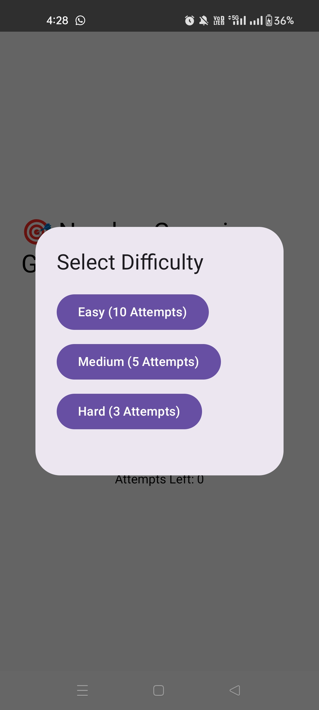
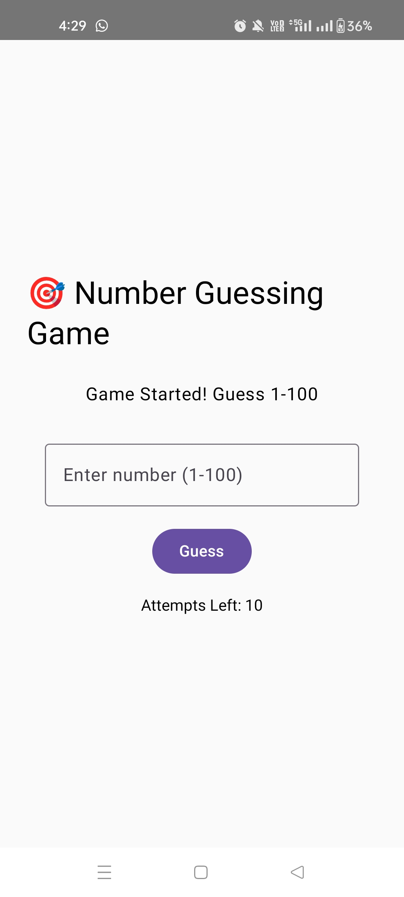
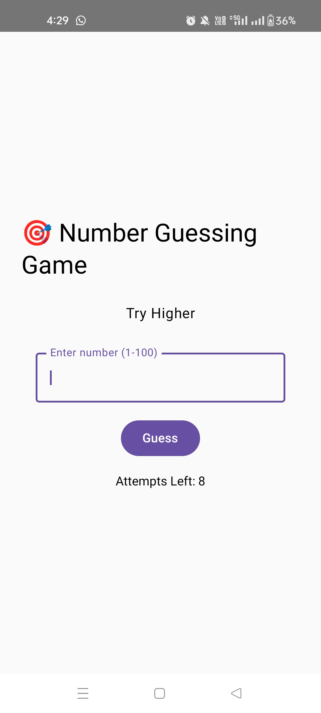
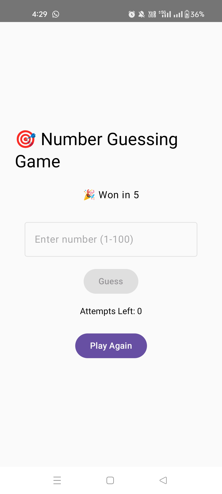

# 🎯 Number Guessing Game (Android - Jetpack Compose)

A modern Android application built using **Jetpack Compose** and **Clean Architecture** principles.
The app challenges users to guess a randomly generated number within limited attempts based on
selected difficulty.

---

## 🚀 Features

* 🎮 Difficulty Levels:

    * Easy (10 attempts)
    * Medium (5 attempts)
    * Hard (3 attempts)
* 🔢 Random number generation (1–100)
* 📊 Real-time feedback:

    * Higher / Lower hints
* 🧠 State-driven UI using StateFlow
* 🎯 Game result handling:

    * Win / Lose states
* 🔄 Restart game functionality

---

## 🏗️ Architecture

This project follows **Clean Architecture + MVVM**:

```
presentation → domain → data
```

### 📦 Layers

#### 1. Presentation Layer

* UI built using Jetpack Compose
* ViewModel manages UI state
* Uses StateFlow for reactive updates

#### 2. Domain Layer

* Business logic abstraction
* Use cases:

    * StartGameUseCase
    * CheckGuessUseCase
* Core model:

    * GameResult (sealed class)

#### 3. Data Layer

* GameRepositoryImpl handles game logic
* Generates random number and manages attempts

---

## 📂 Project Structure

```
com.example.guessnumber
│
├── data/
│   └── repository/
│       └── GameRepositoryImpl.kt
│
├── domain/
│   ├── model/
│   │   └── GameResult.kt
│   ├── repository/
│   │   └── GameRepository.kt
│   └── usecase/
│       ├── StartGameUseCase.kt
│       └── CheckGuessUseCase.kt
│
├── presentation/
│   ├── ui/
│   │   ├── GameScreen.kt
│   │   └── components/
│   │       └── DifficultyDialog.kt
│   │
│   ├── viewmodel/
│   │   └── GameViewModel.kt
│   │
│   ├── state/
│   │   └── GameState.kt
│   │
│   └── theme/
│
└── MainActivity.kt
```

---

## 🧠 Key Concepts Used

* ✅ Jetpack Compose UI
* ✅ StateFlow for state management
* ✅ MVVM architecture
* ✅ Clean Architecture principles
* ✅ Sealed classes for result handling
* ✅ Unidirectional data flow

---

## ⚙️ Tech Stack

* Kotlin
* Jetpack Compose
* Material 3
* StateFlow
* Android SDK (Min SDK 24)

---

## ▶️ How It Works

1. User selects difficulty
2. Game initializes with random number
3. User inputs guesses
4. App responds with:

    * "Higher"
    * "Lower"
5. Game ends when:

    * Correct guess (Win)
    * Attempts exhausted (Lose)

---

## ⚠️ Known Improvements (Future Enhancements)

* Dependency Injection (Hilt)
* Unit testing (ViewModel & UseCases)
* UI animations
* Better dialog UX
* Input validation enhancements
* Dark mode customization

---

## 📸 Screenshots

### 🏠 Home Screen



### 🎯 Easy Selection



### 🎮 Gameplay



### 🏆 Result Screen



---

## 🧪 Testing

Currently:

* Manual testing implemented

Planned:

* Unit tests for ViewModel
* Repository logic tests

---

## 💡 Learning Outcome

This project demonstrates:

* Transition from traditional UI to declarative UI (Compose)
* Proper separation of concerns
* Reactive state handling
* Scalable Android architecture

---

## 📌 Author

**Arshad Rayyan**
Android Developer | Kotlin | Jetpack Compose

---

## ⭐ Contribution

Feel free to fork and improve the project.
Pull requests are welcome.

---